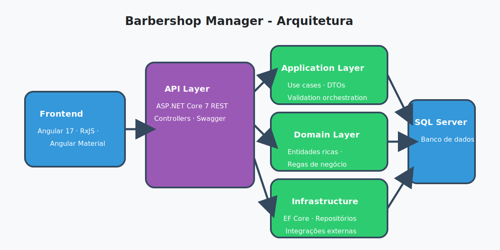

# Arquitetura do Sistema

A solução adota princípios de **Clean Architecture** e **Domain-Driven Design**, separando responsabilidades em camadas independentes. A figura a seguir resume os componentes principais.

## Componentes Principais

### Frontend (Angular 17)
- Componentes reativos para agenda, cadastro de barbeiros e serviços (`frontend/src/app/components/*`).
- Serviços `ApiService` e `AuthService` para consumo da API e gerenciamento de sessão.
- Interceptor `AuthInterceptor` injeta tokens JWT nas requisições autenticadas.
- `AuthGuard` protege rotas sensíveis.

### API (ASP.NET Core 7)
- Controllers RESTful expostos em `backend/src/BarbershopManager.API`.
- Integração com Swagger para documentação e teste manual.
- Middlewares para tratamento de erros, logging e autenticação (a ser expandido).

### Application Layer
- Serviços de caso de uso (`BarberService`, `AppointmentService`, `ServiceOfferingService`, `AuthService`).
- DTOs para entrada/saída desacoplando domínios da camada de transporte.
- Interfaces de repositório (`IBarberRepository`, `IAppointmentRepository`, etc.) definindo contratos de persistência.

### Domain Layer
- Entidades ricas (`Barber`, `ServiceOffering`, `Appointment`, `User`) com invariantes encapsulados.
- Regras de negócio como prevenção de conflitos de agenda e validação de dados obrigatórios.

### Infrastructure Layer
- Implementação concreta de repositórios com Entity Framework Core.
- Configuração de banco SQL Server e migrações.
- Serviços de infraestrutura (ex.: geração de tokens, logging) plugáveis.

## Comunicação Entre Camadas

1. **Frontend → API**: Requisições HTTP autenticadas via `AuthInterceptor`. Os formulários reativos validam dados antes do envio.
2. **API → Application**: Controllers orquestram os serviços de aplicação e traduzem resultados para HTTP.
3. **Application → Domain**: Casos de uso criam/manipulam entidades do domínio, garantindo regras de negócio.
4. **Application → Infrastructure**: Persistência realizada por meio de repositórios que implementam as interfaces definidas.
5. **Infrastructure → Banco de Dados**: Contexto do EF Core aplica migrações e gerencia conexões com o SQL Server.

## Qualidade e Extensibilidade

- **Testabilidade**: O desacoplamento permite mocks dos repositórios nas camadas superiores.
- **Evolução**: Novos canais (ex.: mobile) podem reutilizar Application/Domain sem alterações significativas.
- **Segurança**: Autenticação JWT planejada para proteger endpoints sensíveis, com guardas equivalentes no frontend.
