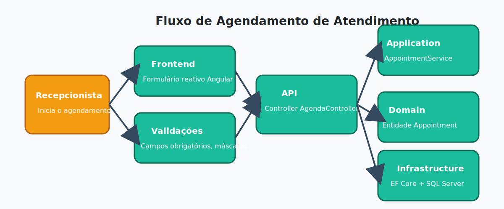

# Casos de Uso e Fluxos

Este documento descreve os principais fluxos do sistema e relaciona cada etapa às funcionalidades implementadas.

## UC-01 — Cadastrar Barbeiro
1. Recepcionista acessa o módulo de profissionais e clica em **“Novo Barbeiro”**.
2. Frontend exibe formulário reativo, validando nome e e-mail obrigatórios.
3. Ao submeter, `ApiService` envia POST `/api/barbers` para o backend.
4. `BarberService` cria entidade `Barber` e persiste via `IBarberRepository`.
5. Usuário recebe confirmação visual e lista é atualizada.

## UC-02 — Cadastrar Serviço
1. Proprietário acessa catálogo e seleciona **“Novo Serviço”**.
2. Formulário coleta título, descrição, duração e preço.
3. API valida dados e cria `ServiceOffering`.
4. Serviço fica disponível para seleção em novos agendamentos.

## UC-03 — Agendar Atendimento
1. Recepcionista seleciona cliente e horário desejado.
2. Frontend busca barbeiros e serviços disponíveis.
3. Formulário reativo garante preenchimento de todos os campos.
4. Requisição POST `/api/appointments` é enviada com token JWT.
5. `AppointmentService` garante que não há conflitos de agenda.
6. Entidade `Appointment` é criada e armazenada via `IAppointmentRepository`.
7. Frontend atualiza grade de horários e mostra confirmação ao usuário.

## UC-04 — Autenticar Usuário
1. Usuário informa e-mail e senha no componente `LoginComponent`.
2. `AuthService` envia POST `/api/auth/login`.
3. Backend valida credenciais e retorna token JWT (`LoginResponse`).
4. Token é salvo no `AuthService` e `AuthInterceptor` passa a anexá-lo às requisições.
5. `AuthGuard` autoriza navegação para módulos restritos.

## UC-05 — Cancelar Atendimento
1. Usuário seleciona um atendimento existente.
2. Ação de cancelamento dispara `DELETE /api/appointments/{id}`.
3. `AppointmentService` remove registro após verificar existência.
4. Frontend notifica sucesso e atualiza visualização.

## Métricas Relevantes

- Tempo médio de agendamento por recepcionista.
- Taxa de cancelamentos por profissional.
- Utilização de serviços (mais vendidos vs. menos utilizados).
- Horários de pico por dia da semana.
